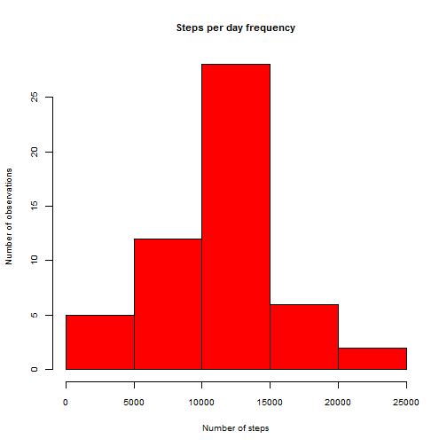
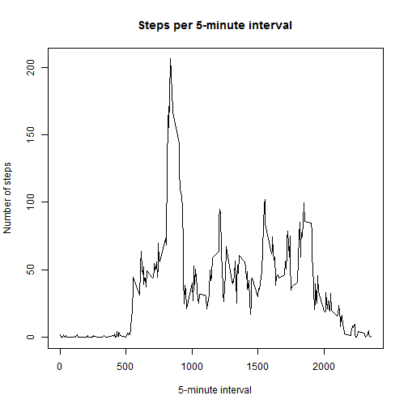
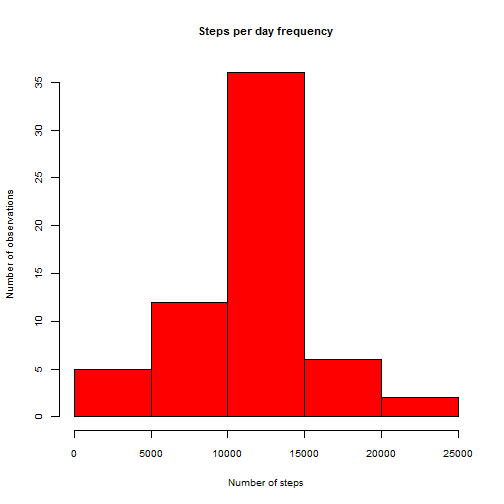
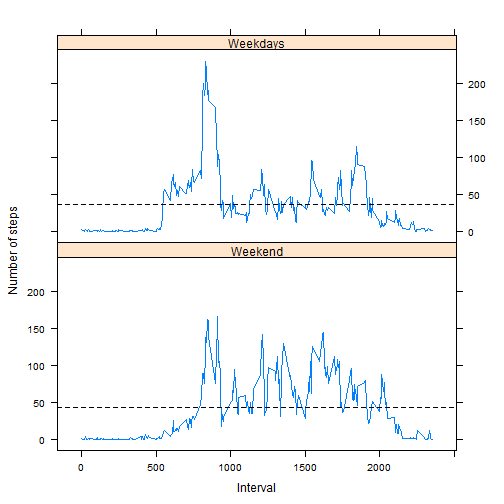

# Reproducible Research: Peer Assessment 1


## Loading and preprocessing the data

Read file from working directory and check the content.

```r
data <- read.csv("activity.csv",
                 na.strings = "NA",
                 header=TRUE,
                 stringsAsFactors = FALSE,
                 nrows=17568+1)
str(data)
```

```
## 'data.frame':	17568 obs. of  3 variables:
##  $ steps   : int  NA NA NA NA NA NA NA NA NA NA ...
##  $ date    : chr  "2012-10-01" "2012-10-01" "2012-10-01" "2012-10-01" ...
##  $ interval: int  0 5 10 15 20 25 30 35 40 45 ...
```

Load needed libraries.

```r
require("stringr")
require("lattice")
require("reshape2")
```


```r
## as i am using a non english system, i have to set the locale so that days of
## the week are in english
## i think this is OS dependent so it may not work on your OS
Sys.setlocale(category = "LC_TIME", locale="English_US.1252")
```

```
## [1] "English_United States.1252"
```


## What is mean total number of steps taken per day?

For this part of the assignment, we ignore the missing values in the dataset (we work on the data.noNA subset). 
We compute the sum of the steps for each day and draw an histogram.

```r
data.noNA<-data[!is.na(data$steps),]
steps.per.day<-tapply(data.noNA$steps,data.noNA$date,FUN=sum)
# Make a histogram of the total number of steps taken each day
hist(x=steps.per.day,
     freq=TRUE,
     col="RED",
     cex.axis=0.8,
     cex.lab=0.8,
     cex.main=0.9,
     main="Steps per day frequency",
     xlab="Number of steps",
     ylab="Number of observations")
```

 

The mean and median total number of steps taken per day are

```r
paste("Median: ",median(steps.per.day))
```

```
## [1] "Median:  10765"
```

```r
paste("Mean: ", mean(steps.per.day))
```

```
## [1] "Mean:  10766.1886792453"
```


## What is the average daily activity pattern?

Compute the values of the average number of steps per interval. 

```r
steps.per.interval<-tapply(data.noNA$steps,data.noNA$interval,FUN=mean)
```

Draw a plot

```r
plot(x=dimnames(steps.per.interval)[[1]],
     y=steps.per.interval,
     xlab="5-minute interval",
     ylab="Number of steps",
     type="l",
     main="Steps per 5-minute interval")
```

 

Compute and display the max coordinates 

```r
ymax<-max(steps.per.interval)
xmax<-names(steps.per.interval[which(steps.per.interval==ymax)])
## tidy text
x <- paste("000",xmax,sep="")
x <- paste(str_sub(x,start=-4L,end=-3L), ":", str_sub(x,start=-2L), sep="")
paste("The interval with the maximum average of steps (",round(ymax,digit=2),"steps) is",x)
```

```
## [1] "The interval with the maximum average of steps ( 206.17 steps) is 08:35"
```


## Inputing missing values


```r
## Calculate and report the total number of missing values in the dataset (i.e. the total number of rows with NAs)
paste("Number of rows with NA steps:",sum(is.na(data$steps)))
```

```
## [1] "Number of rows with NA steps: 2304"
```

We create a complete data set by replacing missing values (NA) in the raw data set by the mean steps of the corresponding interval (note that we have values for all intervals).

```r
data.completed <- data
steps.per.interval<-data.frame(steps.per.interval)
steps.per.interval<-cbind(steps.per.interval,rownames(steps.per.interval))
names(steps.per.interval) <- c("steps","interval")

steps.is.na <- is.na(data.completed$steps)
for (i in steps.per.interval$interval) {
        ok <- data.completed$interval == i & steps.is.na
        a <- steps.per.interval[steps.per.interval$interval==i,]$steps
        data.completed[ok, "steps"] <- a
}

steps.per.day.completed <-tapply(data.completed$steps,data.completed$date,FUN=sum)
```

Now that we have a complete data set, we can make an histogram of it (note that we have more observations now).

```r
# Make a histogram of the total number of steps taken each day
hist(x=steps.per.day.completed,
     freq=TRUE,
     col="RED",
     cex.axis=0.8,
     cex.lab=0.8,
     cex.main=0.9,
     main="Steps per day frequency",
     xlab="Number of steps",
     ylab="Number of observations")
```

 

The mean and median total number of steps taken per day are

```r
paste("Median: ", median(steps.per.day.completed))
```

```
## [1] "Median:  10766.1886792453"
```

```r
paste("Mean: ", mean(steps.per.day.completed))
```

```
## [1] "Mean:  10766.1886792453"
```


## Are there differences in activity patterns between weekdays and weekends?
Here we prepare a new "steps per interval" variable by adding weekend/weekday values to the series. **Data are normalised against the average of the weekend/weekday values.**

```r
day <- weekdays(strptime(data.completed$date, "%Y-%m-%d"))
data.completed$weekday <- factor(!(day %in% c("Saturday", "Sunday")))
levels(data.completed$weekday) <- c("Weekend","Weekdays")

steps.per.interval<-tapply(data.completed$steps,
                           list(data.completed$interval,data.completed$weekday),
                           FUN=mean)

# normalisation of data
steps.per.interval<-(steps.per.interval-colMeans(steps.per.interval))/colMeans(steps.per.interval)
```

Now, we draw the plot using the lattice plotting system. Dotted lines are drawn at 0 which corresponds to the mean value of each series.


```r
# prepare the tmp variable for xyplot display
tmp<-melt(steps.per.interval, id=2:3)
names(tmp)<-c("interval","weekday","steps")

xyplot(steps ~ interval | weekday, data = tmp,
       type = "l",
       layout=c(1,2),
       xlab="Interval",
       ylab="Number of steps",
       panel = function(x, y, ...) {
                panel.xyplot(x, y,...) ## First call the default panel function for 'xyplot'
                panel.abline(h = 0, lty =2) ## Add a horizontal line at the avg value
                })
```

 
